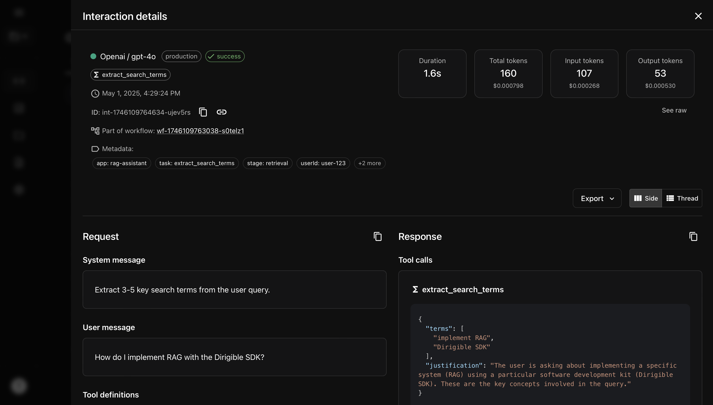

# Dirigible SDK examples

This page contains practical examples of how to use the Dirigible SDK to monitor your AI workflows. We'll demonstrate both simple and advanced scenarios to show how Dirigible can help you track and analyze your LLM interactions.

## Table of Contents

- [Simple workflow example](#simple-workflow-example)
  - [1. Import the SDK functions](#1-import-the-sdk-functions)
  - [2. Initialize the SDK](#2-initialize-the-sdk)
  - [3. Wrap OpenAI client](#3-wrap-openai-client)
  - [4. LLM calls and interaction metadata](#4-llm-calls-and-interaction-metadata)
  - [5. Run the workflow](#5-run-the-workflow)
  - [Visualize on Dirigible](#visualize-on-dirigible)
- [Advanced workflow example](#advanced-workflow-example)
  - [1. Import advanced SDK functions](#1-import-advanced-sdk-functions)
  - [2. Initialize SDK and wrap multiple AI clients](#2-initialize-sdk-and-wrap-multiple-ai-clients)
  - [3. Create services with function calling for search terms](#3-create-services-with-function-calling-for-search-terms)
  - [4. Run the complete RAG workflow](#4-run-the-complete-rag-workflow)
  - [Visualization on Dirigible](#visualization-on-dirigible)

## Simple workflow

This example shows how to monitor a basic customer support workflow that uses OpenAI to classify customer intents and generate responses. We'll demonstrate how to initialize the SDK, wrap an AI client, and add metadata to specific interactions.

### 1. Import the SDK functions

First, we import the three key Dirigible functions: `initialize` for SDK setup, `observeAIClient` for wrapping AI provider clients, and `observeLLM` for adding metadata to specific interactions.

```typescript
import * as dotenv from 'dotenv';
import { initialize, observeAIClient, observeLLM } from '@dirigible-ai/sdk';
import OpenAI from 'openai';

// Load environment variables
dotenv.config();
```

### 2. Initialize the SDK

Now we initialize the SDK with our API credentials and add workflow metadata that will be attached to all interactions in this workflow. This helps search and organize your data in the Dirigible dashboard.

```typescript
initialize({
  apiKey: process.env.DIRIGIBLE_API_KEY,
  projectId: process.env.DIRIGIBLE_PROJECT_ID,
  workflowMetadata: {
    version: '1.0.0',
    app: 'customer-support'
  }
});
```

### 3. Wrap OpenAI client

With a single line of code, we wrap our OpenAI client to automatically track all API calls. This works without changing how you use the client in your code.

```typescript
const openai = observeAIClient(new OpenAI({
  apiKey: process.env.OPENAI_API_KEY
}));
```

### 4. LLM calls and interaction metadata

We create a support agent class with two methods for different tasks: classifying the request intent and generating the response. The `@observeLLM` decorator adds specific metadata to each interaction, making it easier to understand their purpose and filter them in the dashboard.

```typescript
class SupportAgent {
  @observeLLM({
    task: 'classify_intent',
    priority: 'high'
  })
  async classifyCustomerIntent(message: string) {
    return openai.chat.completions.create({
      model: "gpt-4o",
      messages: [
        { role: "system", content: "Classify the customer support intent." },
        { role: "user", content: message }
      ]
    });
  }

  @observeLLM({
    task: 'generate_response',
    tone: 'empathetic'
  })
  async generateResponse(message: string, intent: string) {
    return openai.chat.completions.create({
      model: "gpt-4o",
      messages: [
        { role: "system", content: `You are a support agent. The customer intent is: ${intent}. Be empathetic.` },
        { role: "user", content: message }
      ]
    });
  }
}
```

### 5. Run the workflow

Finally, we create a workflow function that makes both LLM calls. Dirigible automatically associates these calls to the current workflow, providing end-to-end traceability.

```typescript
async function handleCustomerMessage(message: string) {
  const agent = new SupportAgent();
  
  // First LLM call - Classify intent
  const intentResult = await agent.classifyCustomerIntent(message);
  const intent = intentResult.choices[0].message.content || "Unknown intent";
  
  // Second LLM call - Generate response
  const responseResult = await agent.generateResponse(message, intent);
  const response = responseResult.choices[0].message.content || "Sorry, I couldn't generate a response.";
  
  return { intent, response };
}

// Run the workflow
handleCustomerMessage("I've been charged twice for my subscription this month.")
  .then(result => {
    console.log("Intent:", result.intent);
    console.log("Response:", result.response);
  });
```

### Visualize on Dirigible

You can now find your workflow and interactions on Dirigible:


Inspect and exploit individual interactions:


Visualize the workflow:


## Advanced RAG workflow

This example demonstrates a complete Retrieval-Augmented Generation (RAG) system that uses multiple AI providers and additional Dirigible features. We'll show how to save artifacts, add global metadata, and track workflow/interaction IDs across a multi-step process.

### 1. Import advanced SDK functions

In addition to the basic functions, we import more advanced features: `saveArtifact` for storing intermediary data, `addGlobalMetadata` for adding context during execution, and `getWorkflowId`/`getInteractionId` for cross-system tracing.

```typescript
import * as dotenv from 'dotenv';
import { 
  initialize, 
  observeAIClient, 
  observeLLM, 
  saveArtifact,
  addGlobalMetadata,
  getWorkflowId,
  getInteractionId
} from '@dirigible-ai/sdk';
import OpenAI from 'openai';
import { type ChatCompletionTool } from "openai/resources/chat/completions";
import Anthropic from '@anthropic-ai/sdk';
import { searchVectorDatabase, fetchDocument } from './vector-store';

// Load environment variables
dotenv.config();
```

### 2. Initialize SDK and wrap multiple AI clients

We initialize the SDK, wrap clients from both OpenAI and Anthropic, get the workflow ID for tracing, and add global metadata that will be attached to all subsequent interactions.

```typescript
// Initialize the SDK
initialize({
  apiKey: process.env.DIRIGIBLE_API_KEY,
  projectId: process.env.DIRIGIBLE_PROJECT_ID,
  environment: 'production',
  workflowMetadata: {
    version: '1.0.0',
    app: 'rag-assistant'
  }
});

// Wrap multiple AI clients
const openai = observeAIClient(new OpenAI({
  apiKey: process.env.OPENAI_API_KEY
}));

const anthropic = observeAIClient(new Anthropic({
  apiKey: process.env.ANTHROPIC_API_KEY
}));

// Get workflow ID for tracing
const workflowId = getWorkflowId();
console.log(`Workflow ID: ${workflowId}`);

// Add global metadata
addGlobalMetadata({
  userId: 'user-123',
  timestamp: new Date().toISOString()
});
```

### 3. Create LLM and vector search services

We create service classes for our LLM operations. The SearchService uses function calling to get structured search terms, showing how to combine observability with tools. Each decorated method with `@observeLLM` adds specific metadata to the interaction.

```typescript
// Define search terms extraction tool
const searchTermsTools: ChatCompletionTool[] = [{
  type: "function",
  function: {
    name: "extract_search_terms",
    description: "Extract key search terms from the user query",
    parameters: {
      type: "object",
      properties: {
        terms: {
          type: "array",
          items: {
            type: "string"
          },
          description: "Array of search terms extracted from the query"
        },
        justification: {
          type: "string",
          description: "Justification for the selected search terms"
        }
      },
      required: ["terms", "justification"],
      additionalProperties: false
    }
  }
}];

// Search service using function calling
class SearchService {
  @observeLLM({
    task: 'extract_search_terms',
    stage: 'retrieval'
  })
  async generateSearchTerms(query: string) {
    const response = await openai.chat.completions.create({
      model: "gpt-4o",
      messages: [
        { role: "system", content: "Extract 3-5 key search terms from the user query." },
        { role: "user", content: query }
      ],
      tools: searchTermsTools,
      tool_choice: { type: "function", function: { name: "extract_search_terms" } }
    });
    
    // Get interaction ID for this specific call
    const interactionId = getInteractionId();
    console.log(`Search terms interaction ID: ${interactionId}`);
    
    // Extract the structured search terms from the function call
    let terms = [];
    let justification = "";
    
    if (response.choices[0].message.tool_calls) {
      const toolCall = response.choices[0].message.tool_calls[0];
      if (toolCall.function && toolCall.function.arguments) {
        const args = JSON.parse(toolCall.function.arguments);
        terms = args.terms || [];
        justification = args.justification || "";
      }
    }
    
    // Store the justification as an artifact
    saveArtifact('search_terms_justification', { 
      query, 
      terms, 
      justification 
    });
    
    return terms;
  }
}

// Document service for retrieval operations
class DocumentService {
  async retrieveDocuments(query: string, searchTerms: string[]) {
    // Search the vector database
    const results = await searchVectorDatabase(searchTerms.join(' OR '));
    
    // Store search results as an artifact
    saveArtifact('search_results', results, {
      metadata: { 
        query, 
        searchTerms, 
        resultCount: results.length 
      }
    });
    
    // Fetch full documents for top results
    const documents = [];
    for (const result of results.slice(0, 3)) {
      const doc = await fetchDocument(result.id);
      documents.push({
        id: result.id,
        title: doc.title,
        content: doc.content,
        score: result.score
      });
    }
    
    return documents;
  }
}

// Answer service for generating responses with Claude
class AnswerService {
  @observeLLM({
    task: 'generate_answer',
    stage: 'response'
  })
  async generateAnswer(query: string, documents: any[]) {
    // Format documents for Claude
    const context = documents.map((doc, i) => 
      `DOCUMENT ${i+1}: ${doc.title}\n${doc.content}\n`
    ).join('\n');
    
    // Generate the answer with Claude
    const response = await anthropic.messages.create({
      model: "claude-3-5-sonnet-latest",
      messages: [
        { 
          role: "user", 
          content: `QUESTION: ${query}\n\nSOURCES:\n${context}\n\nAnswer the question based on the provided sources. Cite document numbers.` 
        }
      ],
      max_tokens: 1000
    });
    
    // Get interaction ID
    const interactionId = getInteractionId();
    console.log(`Answer generation interaction ID: ${interactionId}`);
    
    // Extract the answer from Claude's response
    let answer = '';
    if (response.content) {
      for (const block of response.content) {
        if (block.type === 'text') {
          answer += block.text;
        }
      }
    }
    
    // Save the final answer as an artifact
    saveArtifact('final_answer', { query, answer });
    
    return answer;
  }
}
```

### 4. Run the complete RAG workflow

Finally, we orchestrate the entire RAG process in a single function using our service classes. Dirigible tracks the complete workflow from search term generation to final answer, across both OpenAI and Anthropic.

```typescript
async function answerQuestion(query: string) {
  console.log(`Processing query: "${query}"`);
  
  // Initialize services
  const searchService = new SearchService();
  const documentService = new DocumentService();
  const answerService = new AnswerService();
  
  // Step 1: Generate search terms with OpenAI using function calling
  const searchTerms = await searchService.generateSearchTerms(query);
  console.log(`Search terms: ${searchTerms.join(', ')}`);
  
  // Step 2: Retrieve relevant documents
  const documents = await documentService.retrieveDocuments(query, searchTerms);
  console.log(`Retrieved ${documents.length} documents`);
  
  // Step 3: Generate answer with Claude
  const answer = await answerService.generateAnswer(query, documents);
  
  return answer;
}

// Execute the workflow
answerQuestion("How do I implement RAG with the Dirigible SDK?")
  .then(answer => {
    console.log("\nFINAL ANSWER:");
    console.log(answer);
    console.log(`\nView workflow: https://dirigible.ai/workflows/${workflowId}`);
  });
```

With this implementation, you get complete observability into your RAG pipeline, including both LLM interactions and intermediary data processing steps. You can track the entire flow from the initial query to the final answer, with detailed metadata at every step.

### Visualization on Dirigible

You can then visualize your workflow on Dirigible, searching in the Observability section or going directly to the newly created `https://dirigible.ai/workflows/${workflowId}`:


Visualize interactions and artifacts with the interactive canvas:


Inspect and exploit individual interactions and artifacts:


